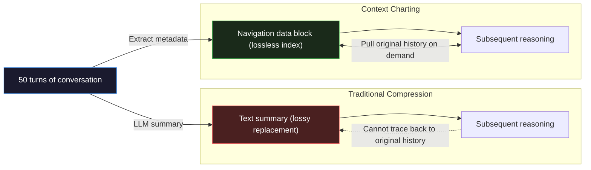
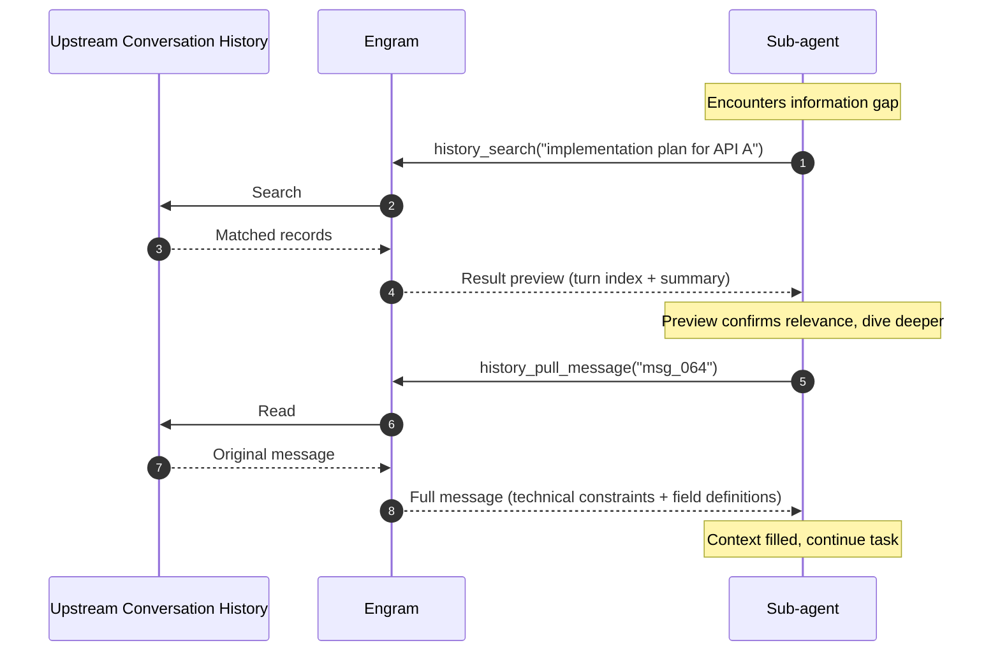
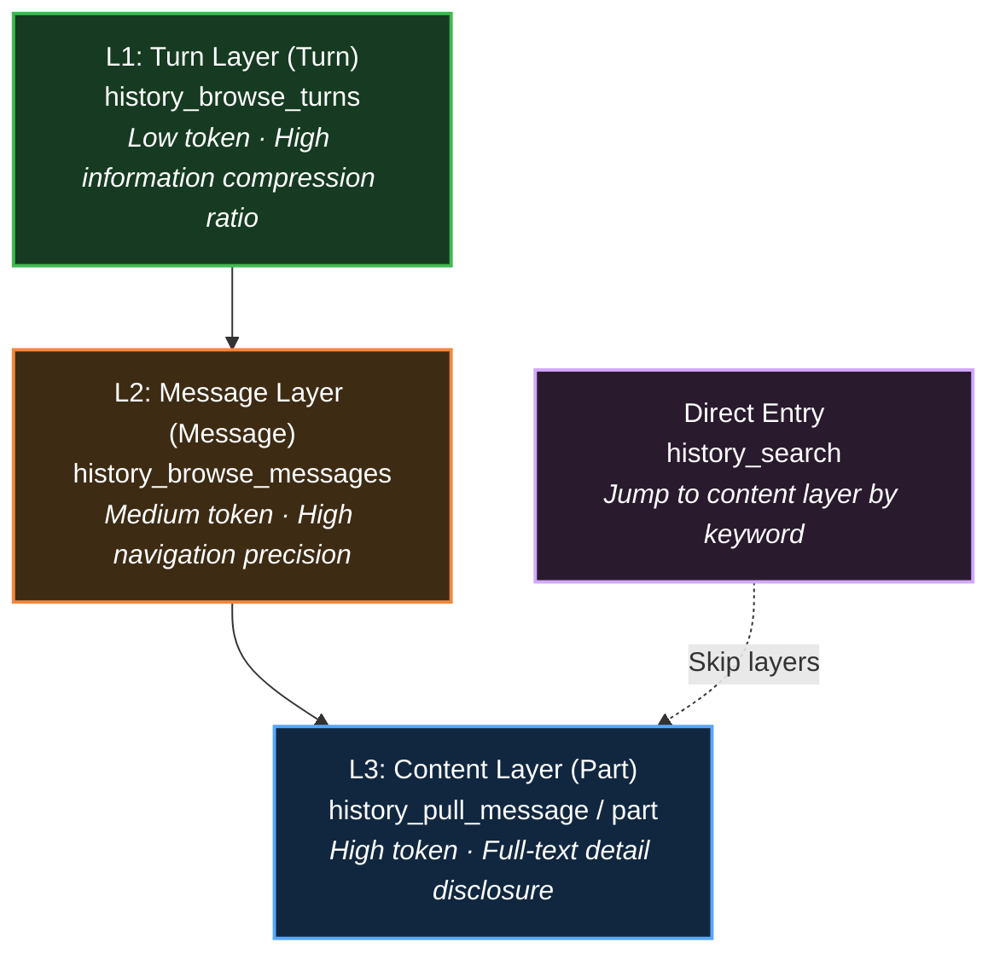

# opencode-engram

[简体中文](./README.zh.md) | [繁體中文](./README.zht.md)

An [OpenCode](https://github.com/opencode-ai/opencode) plugin that gives agents on-demand access to full conversation history — replacing lossy context compression with structured navigation, and bridging context gaps in multi-agent workflows.

Internet information is public-tier experience, local environment information is project-tier experience, and the conversation history agents accumulate during their work — reasoning chains, rejected paths, user constraints — is task-tier experience. Yet this history, the closest to actual work, almost always sinks into storage right after it's produced, never reused by subsequent agents. Engram treats conversation history as an equally important **third information source**, letting agents pull on demand during execution — at the moment of maximum information, the role that best understands the need autonomously decides what it needs.

Engram implements two functional modules: **Context Charting** — an approach that challenges traditional context compression — and **Upstream History Retrieval**, which enables sub-agents to retrieve the conversation history of upstream agents on demand.

> This is a personal project, not officially developed by or affiliated with OpenCode. OpenCode was chosen as the host platform because its openness in conversation history access and plugin integration made this exploration possible.

## Features

The current mainstream paradigm for context migration is push-based: **context is filtered or distilled and then handed off to the next agent.** For example, in multi-agent systems, a parent agent summarizes context into a prompt for the sub-agent; in context compression, context is compressed into a summary and passed to a new version of itself.

However, the push model has an inherent limitation: **it requires anticipating all necessary information before the next agent begins, then transfers it in a highly lossy, irreversible manner.** More dangerous than the information loss itself is that the next agent cannot even perceive the loss — it treats what it receives as the complete reality. So things often end up like this: the agent reasons with total confidence, follows a dubious chain of logic, and produces a skewed result.

Pull-based is the opposite paradigm: **the next agent fetches the context it needs by itself.** During execution, the agent retrieves information on demand as actual gaps arise. Web search, codebase exploration, and most memory systems follow this paradigm. Compared to push, pull has a critical advantage: **the moment of information filtering is delayed from "before work starts" to "when the need emerges", and the filtering entity shifts from an external role to the agent itself. At the moment of maximum information, the role that best understands the need makes the judgment.**

The question is: in context migration scenarios, there are virtually no pull-based designs. Why? I believe it's because people have long overlooked a third important information source beyond internet information and local environment information — **conversation history**. This history has almost never been treated as a resource agents can use; it is not revisited by subsequent agents, nor even by the same agent's compressed self within the same session.

Why has conversation history been neglected for so long? Because the mainstream focuses only on byproducts of conversation history — extracting it into fragmented bits, distilling it into structured summaries — while ignoring direct use of the raw conversation history itself. This history is closest to the agent, yet least utilized. Engram's starting point is to restore conversation history as a resource agents can directly access, using it the same way they use web search and codebase exploration.

### Context Charting

Context compression is where the limitations of the push paradigm are most concentrated.

When conversation turns reach the context window limit, the standard approach is: call an LLM to summarize the conversation history into a text summary, then replace the original history with the summary to free up space. Under this model, the agent in subsequent turns reads a further-distilled summary but treats it as the complete factual basis of the history for its reasoning.

This model has at least three fundamental contradictions that cannot be resolved by optimizing prompts:

- **Cognitive Asymmetry:** Even if prompt optimization makes the model aware it is reading a summary, you cannot give it the meta-cognition of "what was compressed away." Knowing something is missing without knowing *what* is missing is no different from not knowing at all, because the model can only reason based on what it has.
- **Upfront Decision Risk:** The compressing agent must decide what to keep and what to discard without knowing what the subsequent tasks will be. This is an irreversible information loss decision.
- **Cumulative Distortion:** As the conversation continues, summaries get summarized again, forming "summaries of summaries." After multiple iterations, early original solutions, user corrections, and fine-grained constraints gradually disappear, causing the agent's behavior to drift further and further from the original requirements.

In reality, the raw conversation history was never lost — traditional designs simply treated it as a sunk cost. Engram's approach is to abandon the idea of "replacing history with text summaries" and instead provide a set of **structured history navigation data**.



In Engram, "charting" means generating a set of structured navigation data for the currently visible conversation. When compression is triggered, Engram injects a structured data block into the context:

- **Conversation Overview:** Contains a structured index of the currently visible turns along with previews of user and agent messages within each turn. Subsequent agents can use tools to dive into turns of interest for further exploration.
- **Recent Process:** Retains a message window near the latest visible turn, letting the agent quickly understand the current state.
- **Retrieval Guidance:** Through injecting specific prompts, it builds a mental model for the agent, making it value conversation history information as much as local environment information, activating an exploratory mindset.


<details>
<summary>Implementation Notes</summary>

Theoretically, the process of the compressing agent generating a summary could be skipped entirely, but OpenCode does not yet provide an interface to bypass it. For simplicity, Engram currently uses a temporary approach: prompt injection makes the compressing agent return very brief output, then the structured navigation data directly replaces the original content. This is not free — it still incurs one compression inference cost — but it is usually extremely low. (Perhaps in the future, OpenCode can be encouraged to open an interface to solve this.)

</details>

Context Charting fundamentally resolves the core contradictions of context compression:

- The conversation overview is a simple preview of historical messages, naturally lacking in detail. The agent knows something is missing, so it naturally chooses to pull history to fill the gaps.
- During execution, when encountering actual information gaps, the agent autonomously decides the scope and depth of retrospection, shifting the moment of information filtering from compression time to consumption time.
- Conversation history suffers no loss whatsoever over time. No matter how many turns the conversation goes through, the oldest history remains within the agent's reach.

### Upstream History Retrieval

Beyond compression issues in long conversations, multi-agent collaboration faces similar challenges.

Consider a typical scenario in multi-agent collaboration: the user and the main agent go through complex multi-turn discussions, settle on a plan, and accumulate a large number of constraints and process context along the way. Then the main agent wants to delegate a sub-agent to implement it. At this point, it faces a choice: what information should go into the prompt?

A structural problem surfaces here: it must make a judgment before the sub-agent starts working, but the sub-agent's actual needs only emerge during execution.

The more fundamental problem is: reasoning chains, rejected paths, and implicit constraints accumulated over multiple rounds of discussion cannot be compressed into a single prompt. The sub-agent naturally starts work with a massive context deficit — no one knows whether that context is truly important, and the main agent cannot guarantee nothing has been missed.

Even if the plan is perfect and the main agent somehow passes it over completely (e.g., by referencing a plan document), the sub-agent loses the process context of how the plan was discussed, and is likely to execute in ways that deviate from expectations due to misunderstandings.

An obvious solution is to dump all the context directly into the sub-agent's window — but then token waste and context decay follow. Take it a step further and filter for only necessary context? Then we're back to the same problem.

Engram's solution: provide the sub-agent with a set of retrieval tools pointing directly to the main agent's complete conversation history. Whenever it encounters an information gap during execution, it looks it up itself.



Engram provides agents with specialized retrieval tools, each designed around cognitive pathways and progressive disclosure principles, maximizing retrieval efficiency and minimizing token consumption. Token consumption mainly occurs on the paths the agent actually dives into, not from loading everything upfront.

The entire system accesses OpenCode's existing conversation storage in a read-only manner. It writes no data and maintains no derivative models. Zero maintenance cost, zero consistency issues.

The core of this design is not efficiency optimization, although token savings are significant. The core is a transfer of judgment: **"What information is relevant to the current task" is no longer predicted by the main agent at the moment of delegation, but determined autonomously by the sub-agent at the moment of execution based on actual needs.** The former is the moment of least information; the latter is the moment of maximum information.


### Conversation History Access Tools

Context Charting and Upstream History Retrieval share the same set of retrieval tools. These tools are designed in layers according to the data model: **Turn → Message → Part**, following the principle of **Progressive Disclosure**. When executing tasks, an agent can start from the low-token-cost index layer, and only after confirming relevance through previews does it issue higher-token-cost content pulls to deeper levels. This architecture ensures information completeness while achieving optimal token efficiency for ultra-long sessions through precise control of disclosure depth.



`history_search` provides direct access at the **Part level**. When an agent already knows specific keywords or tool call characteristics (e.g., `bash`), it can skip the layer hierarchy and jump directly to specific content.

For detailed tool interface documentation, see [docs/tools.md](docs/tools.md).

#### L1: Turn Preview (history_browse_turns)

This tool provides a global index of the conversation. Each turn contains only a user intent preview and assistant execution metadata (tool statistics, list of modified files). This allows the agent to scan hundreds of turns with minimal token cost and quickly locate targets.

#### L2: Message Preview (history_browse_messages)

View message sequences and their metadata (attachments, tool status) anchored by `message_id`. This layer is used for secondary confirmation within target turns, preventing the agent from blindly pulling full text without first verifying context relevance.

#### L3: Full Pull (history_pull_message / history_pull_part)

This is the highest token consumption layer. `history_pull_message` splits a message into independent parts by type. If content is truncated due to length limits, the agent can further call `history_pull_part` to retrieve the complete full text of that part. Only key content filtered through the previous two layers is allowed into the main context window.

#### Arbitrary Session Access

The tools natively support access to any session, but since this project has not yet introduced a session discovery tool, users need to explicitly specify the target session ID in their instructions. The agent can then work directly based on that session's history. For example:

- "Continue from the latest progress in session `ses_xxx`, and complete the unfinished parts."
- "Draw on the problem-solving experience in session `ses_xxx` to find a viable solution for the current problem."

Session IDs can be obtained via the `opencode session list` command.

## Design Philosophy

### Zero Infrastructure

Unlike most "memory" systems, Engram does not maintain vector databases, does not run embedding pipelines, and does not write any derivative data. The entire system accesses OpenCode's existing conversation storage in a **read-only manner**, with full-text search computed in real time at query time.

This means: zero maintenance cost, zero consistency issues, zero additional storage. The conversation history itself is the database — no need to translate it again.

### Transfer of Judgment

Engram's design does not pursue more efficient information transfer or more precise context compression. Its core is a reallocation of judgment: **"What information is relevant to the current task" is no longer predicted by an external role at the moment of least information, but determined autonomously by the agent itself at the moment of maximum information.**

This principle runs through both functional modules: Context Charting delays the moment of information filtering from compression time to consumption time; Upstream History Retrieval shifts the filtering entity from the main agent to the sub-agent.

## Quick Start

**Prerequisites:** Node.js 22+, [OpenCode](https://github.com/opencode-ai/opencode) installed.

Register the plugin in your opencode.json(c) configuration file:

```jsonc
{
  "plugin": ["opencode-engram"]
}
```

Once done, restart OpenCode to start using it. No additional configuration is needed by default; all features work out of the box.

## Configuration

Both functional modules can be independently enabled or disabled via configuration parameters:

```jsonc
{
  "upstream_history": {
    "enable": true   // Upstream History Retrieval, enabled by default
  },
  "context_charting": {
    "enable": true  // Context Charting, enabled by default
  }
}
```

The configuration file is `opencode-engram.json` / `opencode-engram.jsonc` located in the project root or the global OpenCode configuration directory. Project-level configuration overrides global configuration. Through configuration adjustments, you can finely control the level of detail exposed in tool output, balancing output quality and token consumption. Additionally, you can finely control the display behavior of tool inputs and outputs, with support for custom tools. For complete configuration field documentation, see [docs/config.md](docs/config.md).

## Contributing

Issues and PRs are welcome.

```bash
# Clone and install
git clone https://github.com/NocturnesLK/opencode-engram.git
cd opencode-engram
npm ci

# Type checking
npm run typecheck

# Run tests (80% coverage threshold)
npm run test:coverage

# Run a single test file
npx vitest run src/runtime/runtime.test.ts
```

Test files are co-located with source files (`foo.ts` corresponds to `foo.test.ts`), using the Vitest framework. Please add tests alongside new features.

## Roadmap

- [ ] **Charting Benchmark:** Establish benchmarks to quantify the benefits of Context Charting compared to traditional compression in long-conversation tasks
- [ ] **Cross-platform Support:** Extend retrieval tools to platforms beyond OpenCode (Claude Code, etc.)
- [ ] **Agent Audit:** Add a third functional module where an independent audit agent pulls the execution history of a target agent, for development, debugging, evaluation, and iteration of the target agent

## License

MIT © 2026 NocturnesLK
