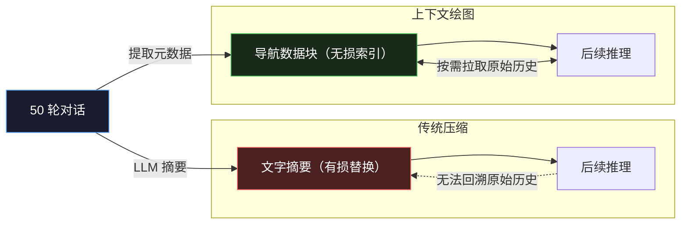
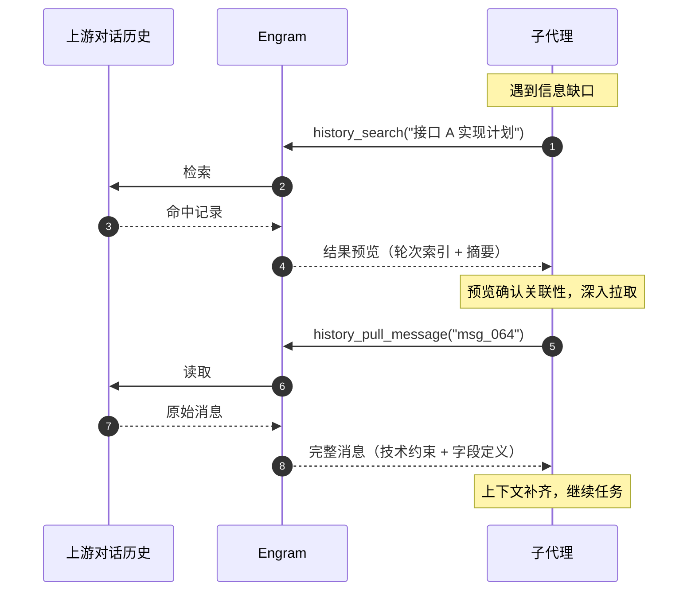
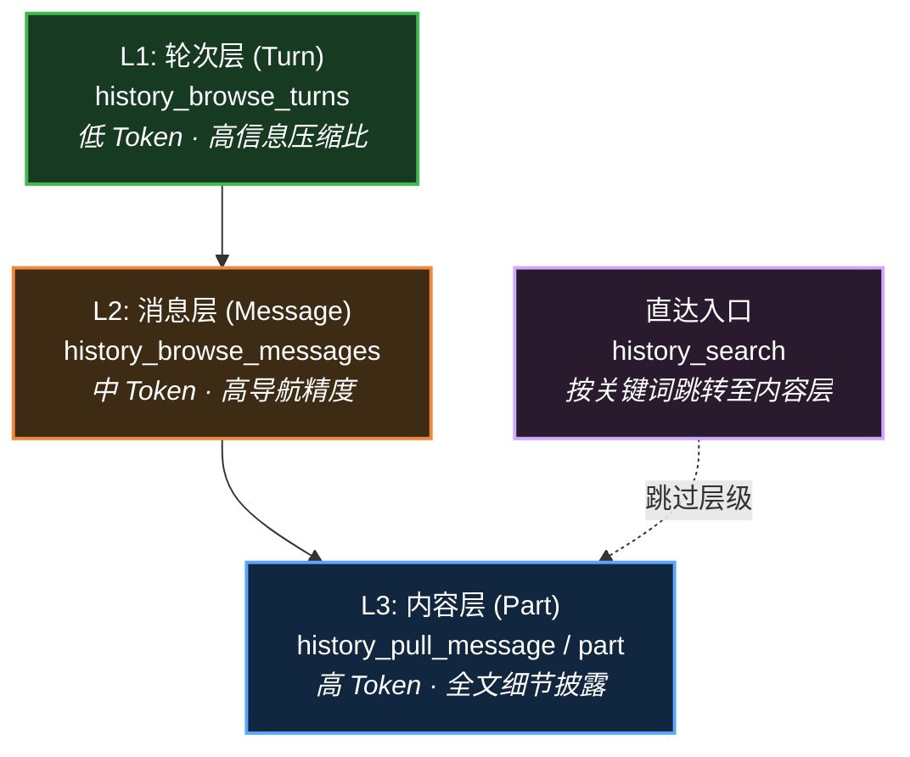

# opencode-engram

为 [OpenCode](https://github.com/opencode-ai/opencode) 开发的拉取式（Pull-based）对话历史检索插件。

互联网信息是公共级的经验，本地环境信息是项目级的经验，而代理在工作中积累的对话历史——推理链、否决路径、用户约束——是任务级的经验。然而这些最贴近实际工作的历史几乎在产生后就沉入存储，从未被后续代理重新利用。Engram 将对话历史视作拥有同等地位的**第三信息源**，让代理在执行过程中按需拉取（Pull），在信息最充分的时刻，由最了解需求的角色自主决定需要什么。

Engram 实现了两个功能模块：**上下文绘图（Context Charting）**——一种挑战传统上下文压缩的方案，以及**上游历史检索**——子代理按需检索上游代理的对话历史。

> 本项目属于个人项目，并非由 OpenCode 官方开发，且不存在隶属关系。选择 OpenCode 作为宿主平台，是因为它在对话历史访问和插件集成上的开放性让本项目的探索成为了可能。

## 功能

当前上下文迁移的主流范式是推入式（Push）：**将上下文经过滤或提炼后移交给下一个代理。** 例如，在多智能体系统中，父代理总结上下文为提示词传递给子代理；又如上下文压缩，上下文被压缩为摘要信息传递给新的自己。

然而，推入式具有本质上的局限：**在下一个代理执行前预判所需的一切信息，然后以损失极大且不可恢复的方式传递。** 比起信息的损失，更危险的是下一个代理甚至无法感知损失的存在，因为它将获得的信息视作完整的现实。于是，最后事情往往变成：代理怀着百分百的信心，进行可疑的推理，最后产出偏离的结果。

拉取式（Pull）是与推入式相对的范式，即**下一个代理自行拉取需要的上下文。** 代理在执行过程中，根据实际遇到的信息缺口按需检索，互联网检索、代码库探索和大部分记忆系统都遵循这一范式。相比推入式，拉取式具有关键的优点：**信息筛选的时刻从"工作开始前"推迟到"需求浮现时"，筛选的主体从外部角色变为代理自身。在信息最充分的时刻，由最了解需求的角色做出判断。**

问题是，在上下文迁移场景中，几乎没有基于拉取式的设计。为什么？我认为是因为长久以来，人们都忽视了对互联网信息和本地环境信息以外的第三个重要信息源的利用，那就是**对话历史**。这些历史几乎从未被当作代理可利用的资源，不会被后续的代理、甚至同一会话中压缩后的自己重新访问。

为什么对话历史长期被忽视？因为主流只关注对话历史的加工产物——将对话历史提取为片段化的碎片，将对话历史提炼为结构化的摘要——却忽视了对原始对话历史的直接利用。这些历史离代理最近，却最少被利用。Engram 的出发点是将对话历史恢复为代理可直接访问的资源，像使用互联网搜索和代码库探索一样使用对话历史。

### 上下文绘图（Context Charting）

上下文压缩是推入式范式局限最为集中的场景。

当对话轮次触及上下文窗口上限时，标准做法是：调用 LLM 将历史对话概括为一段文字摘要，然后用摘要替换原始历史以释放空间。在这种模式下，后续轮次的代理读取到的是经过二次提炼的摘要，却将其作为历史的全部事实基础进行推理。

这种模式至少存在三个难以通过优化提示词解决的根本矛盾：

- **认知不对称**：即便通过优化提示词让模型知道自己读到的是摘要信息，也不可能让模型拥有"从什么压缩而来"的元认知。知道缺失，却不知道缺失了什么，和不知道缺失无异，因为模型只能基于已有的内容推理。
- **决策前置风险**：压缩代理必须在不知道后续具体任务是什么的情况下，提前判断哪些信息该保留、哪些该丢弃。这是一种不可逆的信息丢失决策。
- **累积失真**：随着对话持续进行，摘要会被再次总结，形成"摘要的摘要"。经过多次迭代后，早期的原始方案、用户修正和细粒度约束将逐步消亡，导致代理的行为逐渐偏离最初的需求轨道。

实际上，原始对话历史从未丢失，只是传统设计将其视为一种沉没成本。Engram 的做法是放弃"以文本摘要替代历史"的思路，转而提供一套**结构化的历史导航数据**。



在 Engram 中，"绘图"是指为当前可见对话生成一组结构化导航数据。当触发压缩时，Engram 会在上下文中注入一个结构化数据块：

- **对话概览**：包含当前可见轮次的结构化索引及各轮次内用户消息和代理消息的预览，后续代理可以使用工具切入感兴趣的轮次继续探索。
- **最近过程**：保留最新可见轮次附近的消息窗口，让代理迅速理解当前状态。
- **检索引导**：通过注入特定的提示词，构建代理的心智模型，让它像重视本地环境信息一样重视对话历史信息，激活探索的心智。


<details>
<summary>实现说明</summary>

理论上虽然可以完全跳过压缩代理生成摘要的过程，但是由于 OpenCode 尚未提供跳过的接口，简单起见，当前 Engram 采用一种临时的方式实现：通过提示词注入让压缩代理直接返回非常简短的输出，然后将结构化导航数据直接替换原内容。这不是免费的，仍然会产生一次压缩的推理成本，但通常成本极低。（也许后续可以推动 OpenCode 开放接口来解决此问题）

</details>

上下文绘图从根本上消解了上下文压缩的核心矛盾：

- 对话概览是历史消息的简单预览，天然缺乏细节。代理知道有缺失，于是自然地选择拉取历史来填补缺失。
- 执行中，遇到实际信息缺口时，代理自主决定回溯范围和回溯深度，将信息的筛选时刻从压缩时转变为消费时。
- 对话历史不会随着时间产生丝毫损失，不管对话经历了多少轮次，最久远的历史仍然在代理可达的范围内。

### 上游历史检索

除了长对话中的压缩问题，多智能体协作同样面临类似的挑战。

设想一个多智能体协作中的典型场景：用户和主代理经过复杂的多轮讨论，敲定了一个方案，沿途积累了大量约束和过程上下文。然后主代理想要委托子代理去实现，这时它面临一个选择：把哪些信息写进提示词？

一个结构性的问题在此浮现：它必须在子代理开始工作之前做出判断，但子代理的实际需求只有在执行过程中才会浮现。

更根本的问题是：多轮讨论积累的推理链、否决路径和隐含约束，无法被压缩到一段提示词中。子代理天然带着大量缺失的上下文开始工作，谁也不知道那些上下文到底重不重要，主代理无法保证不会遗漏。

即便方案很完美，主代理也通过某种方式完整传递了方案（例如传递方案文件的引用），但子代理失去了方案讨论的过程上下文，很可能因理解偏差导致不符合预期的执行。

一个显而易见的解决方案是将所有上下文直接塞进子代理的窗口，那么词元浪费和上下文腐坏问题也会随之而来。更进一步，通过某种策略过滤必要上下文？那么又遇到了前面的问题。

Engram 的解决方案是：给子代理提供一组检索工具，直接指向主代理的完整对话历史。在执行过程中遇到任何信息缺口时，它自己去查。



Engram 给代理提供了专用的检索工具，每个工具都按认知路径和渐进式披露原则设计，最大化检索效率和最小化词元消耗，词元的主要消耗只发生在代理实际深入的路径上，而非全量加载。

整个系统以只读方式访问 OpenCode 已有的对话存储。不写入数据，不维护派生模型。零维护成本，零一致性问题。

这个设计的核心不是效率优化，虽然词元节省是显著的。核心在于一个判断权的转移：**"什么信息与当前任务相关"，不再由主代理在委派时刻预判，而由子代理在执行时刻根据实际需求自主决定。** 前者是信息最不充分的时刻，后者是信息最充分的时刻。


### 对话历史访问工具

上下文绘图和上游历史检索共享同一套检索工具。这些工具按照数据模型进行分层设计：**Turn（轮次）→ Message（消息）→ Part（片段）**，遵循**渐进式披露（Progressive Disclosure）**原则。代理在执行任务时，可以从低 Token 消耗的索引层开始，仅在通过预览确认了关联性后，才向更深层级发起高 Token 消耗的内容拉取。这种架构在确保信息完整性的同时，通过精确控制披露深度，实现了处理超长会话时的 Token 效率最优解。



`history_search` 提供了针对 **Part 层级** 的直接访问能力。当代理已知特定关键词或工具调用特征（如 `bash`）时，可以跳过层级顺序，直接定位到具体内容。

详细的工具接口说明请参见 [docs/tools.md](docs/tools.md)。

#### L1：轮次预览（history_browse_turns）

该工具提供对话的全局索引。每轮仅包含 user 意图预览和 assistant 的执行元数据（工具统计、修改文件列表）。这使得代理能以极低的 Token 开销扫描数百轮对话，快速锁定目标。

#### L2：消息预览（history_browse_messages）

以 `message_id` 为锚点查看消息序列及其元数据（附件、工具状态）。本层级用于在目标轮次内进行二次确认，避免代理在未校验上下文关联性时盲目拉取全量文本。

#### L3：全量拉取（history_pull_message / history_pull_part）

这是 Token 消耗最高的层级。`history_pull_message` 将消息按类型拆分为独立片段（Part）。若内容因长度限制被截断，代理可进一步调用 `history_pull_part` 获取该片段的完整全文。只有经过前两层筛选出的关键内容，才会被允许进入主上下文窗口。

#### 任意会话访问

工具原生支持对任意会话的访问，但由于本项目尚未引入会话发现工具，用户需要在指令中显式指定目标会话 ID，然后便让代理基于该会话的历史直接开展工作。例如：

- "从会话 `ses_xxx` 最新的进展继续，补全尚未完成的部分。"
- "参考会话 `ses_xxx` 中的解决经验，为当前问题找到可行的解决方案。"

会话 ID 可以通过 `opencode session list` 命令查询获得。

## 设计哲学

### 零基础设施

与大多数"记忆"系统不同，Engram 不维护向量数据库、不运行 embedding 管线、不写入任何派生数据。整个系统以**只读方式**访问 OpenCode 已有的对话存储，全文搜索在查询时实时计算。

这意味着：零维护成本，零一致性问题，零额外存储。对话历史本身就是数据库，无需将它再翻译一遍。

### 判断权转移

Engram 的设计不追求更高效的信息传递或更精准的上下文压缩。它的核心是一个判断权的重新分配：**"什么信息与当前任务相关"，不再由外部角色在信息最不充分的时刻预判，而由代理自身在信息最充分的时刻自主决定。**

这个原则贯穿两个功能模块：上下文绘图将信息筛选的时刻从压缩时推迟到消费时，上游历史检索将信息筛选的主体从主代理转移到子代理。

## 快速开始

**前置条件：** Node.js 22+，[OpenCode](https://github.com/opencode-ai/opencode) 已安装。

在 opencode.json(c) 配置文件中注册插件：

```jsonc
{
  "plugin": ["opencode-engram"]
}
```

完成后重启 OpenCode 即可体验。默认无需额外配置，所有功能开箱即用。

## 配置

两个功能模块可以通过配置参数独立启用或禁用：

```jsonc
{
  "upstream_history": {
    "enable": true   // 上游历史检索，默认启用
  },
  "context_charting": {
    "enable": true  // 上下文绘图，默认启用
  }
}
```

配置文件为项目根目录或全局 OpenCode 配置目录下的 `opencode-engram.json` / `opencode-engram.jsonc`，项目级配置会覆盖全局配置。通过调整配置，可以精细控制工具输出的细节暴露程度，以平衡输出质量与词元消耗。此外，还可以精细控制工具的输入和输出的显示行为，支持自定义工具。完整的配置字段说明请参见 [docs/config.md](docs/config.md)。

## 贡献

欢迎提交 issue 和 PR。

```bash
# 克隆并安装
git clone https://github.com/NocturnesLK/opencode-engram.git
cd opencode-engram
npm ci

# 类型检查
npm run typecheck

# 运行测试（覆盖率阈值 80%）
npm run test:coverage

# 运行单个测试文件
npx vitest run src/runtime/runtime.test.ts
```

测试文件与源文件共位（`foo.ts` 对应 `foo.test.ts`），使用 Vitest 框架。新功能请同步添加测试。

## Roadmap

- [ ] **绘图基准**：建立基准测试，量化上下文绘图在长对话任务中相比传统压缩的效益
- [ ] **其他平台支持**：将检索工具扩展到 OpenCode 以外的平台（Claude Code等）
- [ ] **代理审查**：新增第三种功能，由独立审查代理拉取目标代理的执行历史，用于目标代理的开发、调试、评估和迭代

## License

MIT © 2026 NocturnesLK
