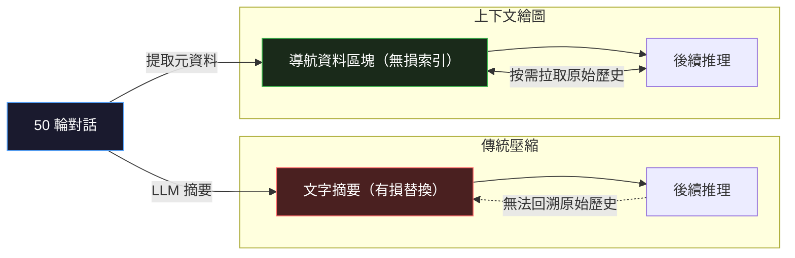
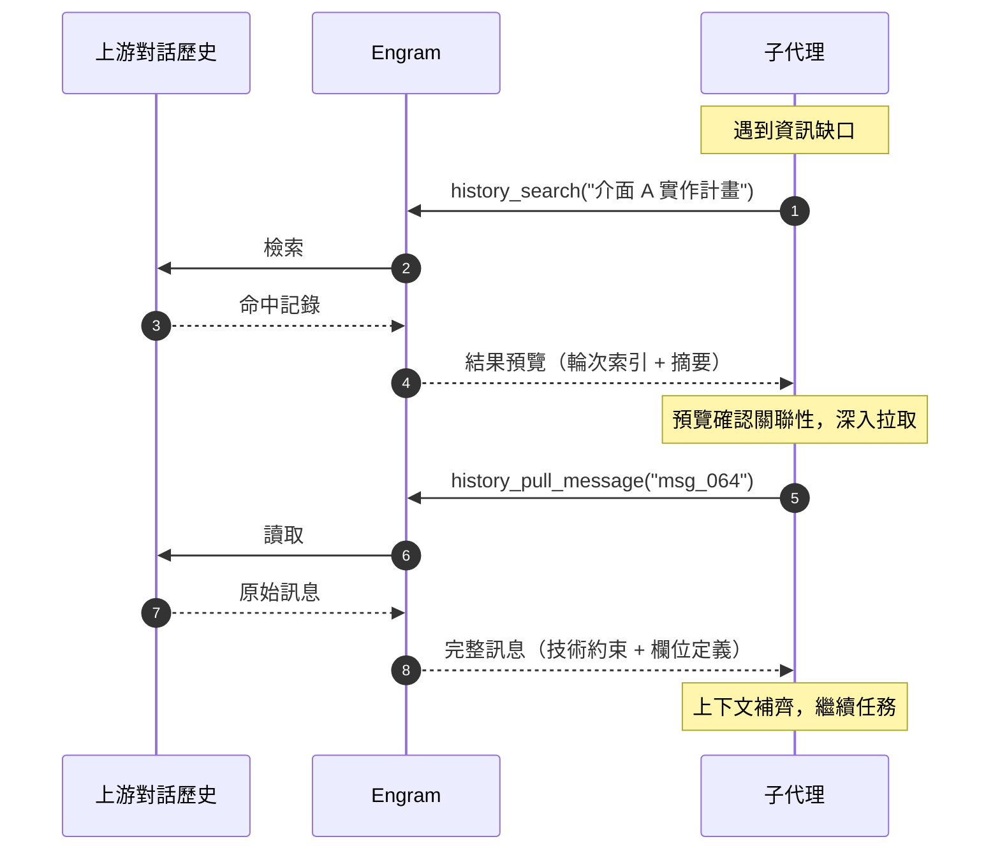
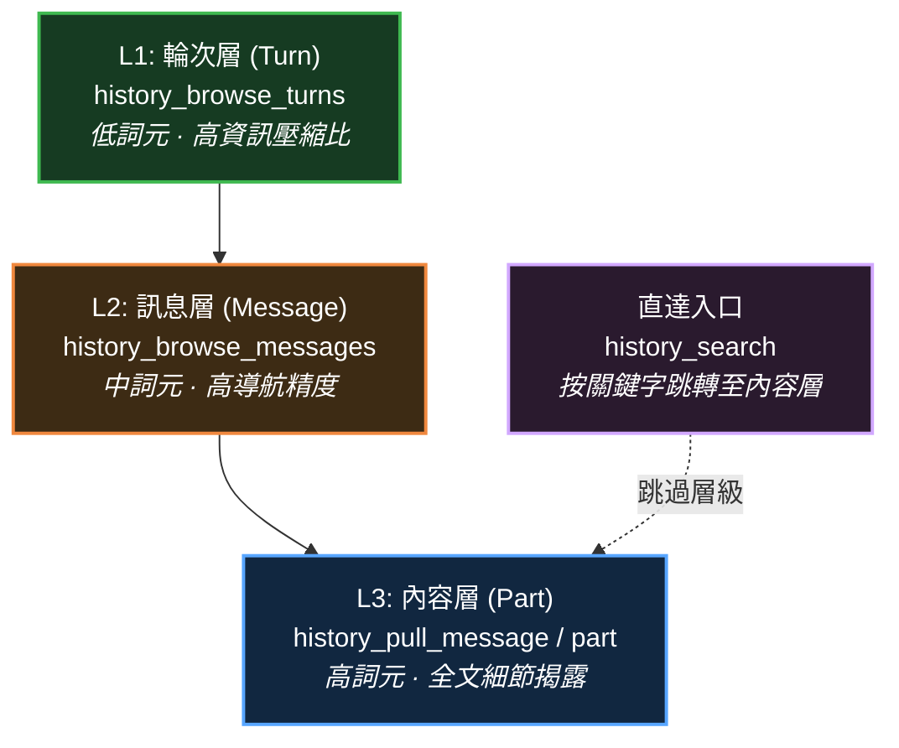

# opencode-engram

為 [OpenCode](https://github.com/opencode-ai/opencode) 開發的拉取式（Pull-based）對話歷史檢索插件。

網際網路資訊是公共層級的經驗，本地環境資訊是專案層級的經驗，而代理在工作中累積的對話歷史——推理鏈、否決路徑、使用者約束——則是任務層級的經驗。然而這些最貼近實際工作的歷史幾乎在產生後就沉入儲存空間，從未被後續代理重新利用。Engram 將對話歷史視作同等重要的**第三資訊來源**，讓代理在執行過程中按需拉取（Pull），在資訊最充分的時刻，由最了解需求的角色自主決定需要什麼。

Engram 實作了兩個功能模組：**上下文繪圖（Context Charting）**——一種挑戰傳統上下文壓縮的方案，以及**上游歷史檢索**——讓子代理按需檢索上游代理的對話歷史。

> 本專案屬於個人專案，並非由 OpenCode 官方開發，且不存在隸屬關係。選擇 OpenCode 作為宿主平台，是因為它在對話歷史存取和插件整合上的開放性，讓本專案的探索成為可能。

## 功能

目前上下文遷移的主流範式是推入式（Push）：**將上下文經過濾或提煉後交給下一個代理。** 例如，在多代理系統中，父代理將上下文總結成提示詞傳遞給子代理；又如上下文壓縮，上下文被壓縮為摘要資訊傳遞給新的自己。

然而，推入式具有本質上的侷限：**它要求在下一個代理開始之前預判所需的一切資訊，然後以損失極大且不可恢復的方式傳遞。** 比起資訊損失本身，更危險的是下一個代理甚至無法感知損失的存在，因為它會把自己得到的內容視為完整現實。於是，最後事情往往變成：代理懷著百分之百的信心，進行可疑的推理，最後產出偏離的結果。

拉取式（Pull）則是與推入式相對的範式，也就是**由下一個代理自行拉取所需的上下文。** 代理在執行過程中，根據實際遇到的資訊缺口按需檢索；網路搜尋、程式碼庫探索和大部分記憶系統都遵循這一範式。相較於推入式，拉取式具有關鍵優勢：**資訊篩選的時刻從「工作開始前」推遲到「需求浮現時」，篩選的主體也從外部角色變為代理自身。在資訊最充分的時刻，由最了解需求的角色做出判斷。**

問題是，在上下文遷移場景中，幾乎沒有基於拉取式的設計。為什麼？我認為是因為長久以來，人們都忽視了網際網路資訊和本地環境資訊之外的第三個重要資訊來源，那就是**對話歷史**。這些歷史幾乎從未被當作代理可利用的資源，不會被後續代理、甚至同一會話中壓縮後的自己重新存取。

為什麼對話歷史長期被忽視？因為主流只關注對話歷史的加工產物——將對話歷史提取為片段化的碎片，將對話歷史提煉為結構化摘要——卻忽視了對原始對話歷史的直接利用。這些歷史離代理最近，卻最少被利用。Engram 的出發點，是將對話歷史恢復為代理可直接存取的資源，像使用網路搜尋和程式碼庫探索一樣使用對話歷史。

### 上下文繪圖（Context Charting）

上下文壓縮是推入式範式侷限最為集中的場景。

當對話輪次觸及上下文視窗上限時，標準做法是：呼叫 LLM 將歷史對話概括為一段文字摘要，然後用摘要替換原始歷史以釋放空間。在這種模式下，後續輪次的代理讀到的是經過二次提煉的摘要，卻將其作為歷史的全部事實基礎進行推理。

這種模式至少存在三個難以透過優化提示詞解決的根本矛盾：

- **認知不對稱**：即便透過優化提示詞讓模型知道自己讀到的是摘要資訊，也不可能讓模型擁有「從什麼壓縮而來」的元認知。知道有缺失，卻不知道缺失了什麼，和不知道缺失並無差別，因為模型只能根據已有內容推理。
- **決策前置風險**：壓縮代理必須在不知道後續具體任務是什麼的情況下，提前判斷哪些資訊該保留、哪些該丟棄。這是一種不可逆的資訊損失決策。
- **累積失真**：隨著對話持續進行，摘要會被再次總結，形成「摘要的摘要」。經過多次迭代後，早期的原始方案、使用者修正和細粒度約束將逐步消亡，導致代理的行為逐漸偏離最初的需求軌道。

實際上，原始對話歷史從未丟失，只是傳統設計將其視為一種沉沒成本。Engram 的做法是放棄「以文字摘要替代歷史」的思路，轉而提供一套**結構化的歷史導航資料**。



在 Engram 中，「繪圖」是指為當前可見對話生成一組結構化導航資料。當觸發壓縮時，Engram 會在上下文中注入一個結構化資料區塊：

- **對話概覽**：包含當前可見輪次的結構化索引及各輪次內使用者訊息和代理訊息的預覽，後續代理可以使用工具切入感興趣的輪次繼續探索。
- **最近過程**：保留最新可見輪次附近的訊息視窗，讓代理快速理解當前狀態。
- **檢索引導**：透過注入特定提示詞，為代理建立心智模型，使其像重視本地環境資訊一樣重視對話歷史資訊，啟動探索心智。

<details>
<summary>實作說明</summary>

理論上雖然可以完全跳過壓縮代理生成摘要的過程，但是由於 OpenCode 尚未提供跳過的介面，為求簡單，目前 Engram 採用一種暫時性的做法：透過提示詞注入讓壓縮代理直接返回非常簡短的輸出，然後將結構化導航資料直接替換原內容。這不是免費的，仍然會產生一次壓縮推理成本，但通常非常低。（也許後續可以推動 OpenCode 開放介面來解決這個問題）

</details>

上下文繪圖從根本上消解了上下文壓縮的核心矛盾：

- 對話概覽只是歷史訊息的簡單預覽，天然缺乏細節。代理知道有缺失，於是自然會選擇拉取歷史來補足缺口。
- 在執行中遇到實際資訊缺口時，代理會自主決定回溯範圍和回溯深度，將資訊篩選的時刻從壓縮時轉變為消費時。
- 對話歷史不會隨著時間產生任何損失，不管對話經歷了多少輪次，最久遠的歷史仍然在代理可達範圍內。

### 上游歷史檢索

除了長對話中的壓縮問題，多代理協作同樣面臨類似挑戰。

想像多代理協作中的典型場景：使用者和主代理經過複雜的多輪討論，敲定了一個方案，沿途累積了大量約束和過程上下文。接著主代理想要委派子代理去實作，這時它面臨一個選擇：該把哪些資訊寫進提示詞？

一個結構性問題在此浮現：它必須在子代理開始工作之前做出判斷，但子代理的實際需求只有在執行過程中才會浮現。

更根本的問題是：多輪討論累積的推理鏈、否決路徑和隱含約束，無法被壓縮成一段提示詞。子代理天然帶著大量缺失的上下文開始工作，誰也不知道那些上下文到底重不重要，主代理也無法保證不會遺漏。

即使方案非常完美，主代理也透過某種方式完整傳遞了方案（例如傳遞方案文件的引用），但子代理失去了方案討論的過程上下文，很可能因理解偏差而導致執行不符合預期。

一個顯而易見的解法是把所有上下文直接塞進子代理的視窗，那麼詞元浪費和上下文腐化問題也會隨之而來。再進一步，只過濾出必要上下文？那又回到前面的問題。

Engram 的解法是：為子代理提供一組檢索工具，直接指向主代理的完整對話歷史。在執行過程中遇到任何資訊缺口時，它自己去查。



Engram 為代理提供專用的檢索工具，每個工具都依照認知路徑與漸進式揭露原則設計，最大化檢索效率並最小化詞元消耗；詞元的主要消耗只發生在代理實際深入的路徑上，而不是全量載入。

整個系統以唯讀方式存取 OpenCode 既有的對話儲存。不寫入資料，不維護衍生模型。零維護成本，零一致性問題。

這個設計的核心不是效率最佳化，雖然詞元節省非常顯著。核心在於一個判斷權的轉移：**「什麼資訊與當前任務相關」，不再由主代理在委派時刻預判，而由子代理在執行時刻根據實際需求自主決定。** 前者是資訊最不充分的時刻，後者是資訊最充分的時刻。

### 對話歷史存取工具

上下文繪圖和上游歷史檢索共享同一套檢索工具。這些工具依照資料模型分層設計：**Turn（輪次）→ Message（訊息）→ Part（片段）**，遵循**漸進式揭露（Progressive Disclosure）**原則。代理在執行任務時，可以從低詞元消耗的索引層開始，只有在透過預覽確認關聯性之後，才向更深層級發起高詞元消耗的內容拉取。這種架構在確保資訊完整性的同時，透過精確控制揭露深度，實現處理超長會話時的詞元效率最佳化。



`history_search` 提供針對 **Part 層級** 的直接存取能力。當代理已知特定關鍵字或工具呼叫特徵（例如 `bash`）時，可以跳過層級順序，直接定位到具體內容。

詳細的工具介面說明請參見 [docs/tools.md](docs/tools.md)。

#### L1：輪次預覽（history_browse_turns）

此工具提供對話的全域索引。每輪僅包含 user 意圖預覽和 assistant 執行中繼資料（工具統計、修改檔案清單）。這使得代理能以極低的詞元成本掃描數百輪對話，快速鎖定目標。

#### L2：訊息預覽（history_browse_messages）

以 `message_id` 為錨點查看訊息序列及其中繼資料（附件、工具狀態）。本層級用於在目標輪次內進行二次確認，避免代理在未驗證上下文關聯性時盲目拉取全量文字。

#### L3：全量拉取（history_pull_message / history_pull_part）

這是詞元消耗最高的層級。`history_pull_message` 會將訊息按類型拆分為獨立片段（Part）。若內容因長度限制被截斷，代理可進一步呼叫 `history_pull_part` 取得該片段的完整全文。只有經過前兩層篩選出的關鍵內容，才會被允許進入主上下文視窗。

#### 任意會話存取

工具原生支援對任意會話的存取，但由於本專案尚未引入會話發現工具，使用者需要在指令中明確指定目標會話 ID，然後讓代理基於該會話的歷史直接展開工作。例如：

- 「從會話 `ses_xxx` 最新的進展繼續，補完尚未完成的部分。」
- 「參考會話 `ses_xxx` 中的解法經驗，為當前問題找出可行方案。」

會話 ID 可以透過 `opencode session list` 指令查詢。

## 設計哲學

### 零基礎設施

與大多數「記憶」系統不同，Engram 不維護向量資料庫、不執行 embedding 流程、不寫入任何衍生資料。整個系統以**唯讀方式**存取 OpenCode 既有的對話儲存，全文搜尋在查詢時即時計算。

這意味著：零維護成本，零一致性問題，零額外儲存。對話歷史本身就是資料庫，不需要再翻譯一次。

### 判斷權轉移

Engram 的設計不追求更高效的資訊傳遞或更精準的上下文壓縮。它的核心是一種判斷權的重新分配：**「什麼資訊與當前任務相關」不再由外部角色在資訊最不充分的時刻預判，而由代理自身在資訊最充分的時刻自主決定。**

這個原則貫穿兩個功能模組：上下文繪圖將資訊篩選的時刻從壓縮時推遲到消費時，上游歷史檢索則將資訊篩選的主體從主代理轉移到子代理。

## 快速開始

**前置條件：** Node.js 22+，已安裝 [OpenCode](https://github.com/opencode-ai/opencode)。

在 opencode.json(c) 設定檔中註冊插件：

```jsonc
{
  "plugin": ["opencode-engram"]
}
```

完成後重新啟動 OpenCode 即可開始使用。預設無需額外設定，所有功能開箱即用。

## 設定

兩個功能模組可以透過設定參數分別啟用或停用：

```jsonc
{
  "upstream_history": {
    "enable": true   // 上游歷史檢索，預設啟用
  },
  "context_charting": {
    "enable": true  // 上下文繪圖，預設啟用
  }
}
```

設定檔位於專案根目錄或全域 OpenCode 設定目錄中的 `opencode-engram.json` / `opencode-engram.jsonc`。專案層級設定會覆蓋全域設定。透過調整設定，可以精細控制工具輸出中暴露的細節程度，在輸出品質與詞元消耗之間取得平衡。此外，也可以精細控制工具輸入與輸出的顯示行為，並支援自訂工具。完整的設定欄位說明請參見 [docs/config.md](docs/config.md)。

## 貢獻

歡迎提交 issue 和 PR。

```bash
# 克隆並安裝
git clone https://github.com/NocturnesLK/opencode-engram.git
cd opencode-engram
npm ci

# 類型檢查
npm run typecheck

# 執行測試（覆蓋率門檻 80%）
npm run test:coverage

# 執行單一測試檔
npx vitest run src/runtime/runtime.test.ts
```

測試檔與來源檔共位（`foo.ts` 對應 `foo.test.ts`），使用 Vitest 框架。新增功能請同步補上測試。

## Roadmap

- [ ] **繪圖基準**：建立基準測試，量化上下文繪圖在長對話任務中相較於傳統壓縮的效益
- [ ] **其他平台支援**：將檢索工具擴展到 OpenCode 以外的平台（Claude Code 等）
- [ ] **代理審查**：新增第三種功能，由獨立審查代理拉取目標代理的執行歷史，用於目標代理的開發、除錯、評估與迭代

## License

MIT © 2026 NocturnesLK
